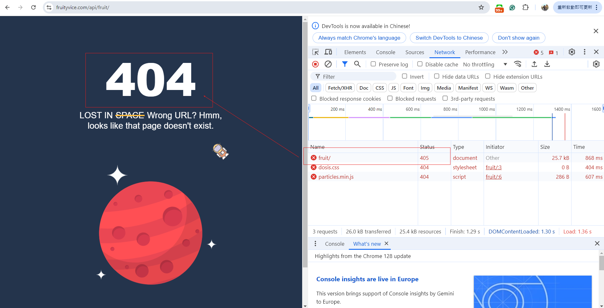

## API testing
### `API Document: https://www.fruityvice.com/doc/index.html#api-GET-GET`
## Test 1
### `API: https://www.fruityvice.com/api/fruit/all`

| Test Case                             | Test Steps                                                         | Expected Result | Test Result |
|:--------------------------------------|:-------------------------------------------------------------------|:----------------|:------------|
| Verify the api can get all fruit data | 1. Use 'get' to get the API response   2. Check the status code | 200             | 200         |

## Test 2
### `API: https://www.fruityvice.com/api/fruit/{FruitName}`

| Test Case                                            | Test Steps                                                                                                                                                                                                                             | Parameters                                                                           | Expected Result                                                                                                                                                                                                                                                                           | Test Result                                                                                                           |
|:-----------------------------------------------------|:---------------------------------------------------------------------------------------------------------------------------------------------------------------------------------------------------------------------------------------|:-------------------------------------------------------------------------------------|:------------------------------------------------------------------------------------------------------------------------------------------------------------------------------------------------------------------------------------------------------------------------------------------|:----------------------------------------------------------------------------------------------------------------------|
| Varify the status code is the same as their document | 1. Use 'get' to get the API response   2. Check the status code   3. If status code is 404, check the error message display correctly without typo   4. If status code is 200, check if API response the correct fruit or not | [1] "Persimmon",  [2] "123",  [3] "  ",  [4] "  banana",  [5] "Select *" | [1]"Persimmon" -> 200, Name: "Persimmon",  [2] "123" -> 404, Error msg: '{"error":"Not found"}',  [3] "  " -> 404, Error msg: '{"error":"Not found"}',  [4] "  banana" -> 404, Error msg: '{"error":"Not found"}',  [5] "Select *" -> 404, Error msg: '{"error":"Not found"}' | The same as expected result and document, but the response of "  " on the website disply 405    |
|                                                      |                                                                                                                                                                                                                                        |                                                                                      |                                                                                                                                                                                                                                         |                                                                                      |                                                                                                                                                                                                                                                                                           |                                                                                                                       |

## Test 3
### `API: https://www.fruityvice.com/api/fruit/{Nutrition}?min={value}&max={value}`

| Test Case                                                        | Test Steps                                                                                                                                                                                                                                                          | Parameters                                                             | Expected Result                                                                                                                                                                                                              | Test Result                              |
|:-----------------------------------------------------------------|:--------------------------------------------------------------------------------------------------------------------------------------------------------------------------------------------------------------------------------------------------------------------|:-----------------------------------------------------------------------|:-----------------------------------------------------------------------------------------------------------------------------------------------------------------------------------------------------------------------------|:-----------------------------------------|
| Verify the status code and the correctness of nutrition criteria | 1. Use 'get' to get the API response   2. Check the status code   3. If status code is 404, check the error message display correctly without typo   4. If status code is 200, check the API response the correct range of min and max for the {Nutrition} | [1] "protein" == 1,  [2] 0 <= "fat" <= 0.5,  [3] 5 <= "fat" <= 0 | [1] "protein" == 1 -> 200, they all are in the range,  [2] 0 <= "fat" <= 0.5 -> 200, they all are in the range,  [3] 5 <= "fat" <= 0 -> 404, Error msg: '{"error":"No fruits with given nutritional parameter found"}' | The same as expected result and document |
